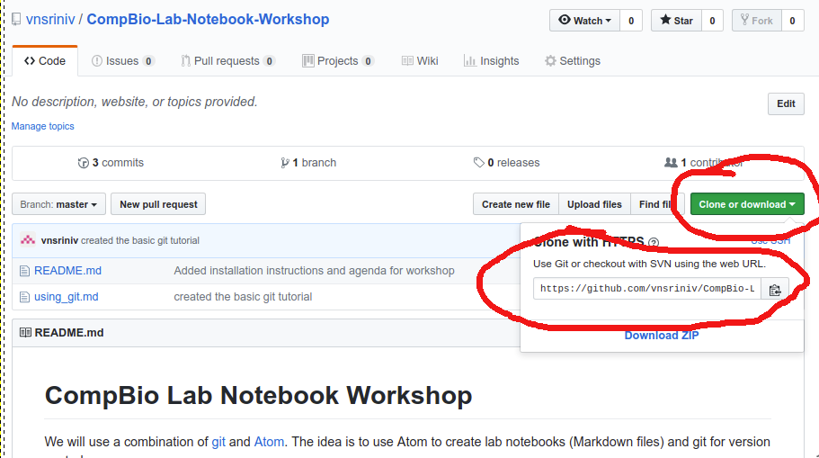

# Using Git
I am not going to try to reinvent the wheel here. Software Carpentry has a great [tutorial](https://swcarpentry.github.io/git-novice/) that you should go through if you want to use Git and GitHub. Here I am going cover a few basic commands for the purpose of this workshop. This won't be comprehensive but will hopefully take away some fear associated with using Git (which I had.. you might be different!)

## Basic Commands

Let us first create an empty directory where we are going to create a lab notebook for a project.

```
#Create a new project directory
mkdir example_project

#Navigate to the directory
cd example_project

# Initialize a new git repository
git init
```

Now that we have created a new git directory. Lets create a new file and add some contents to it.

```
touch README.md

echo -e "This is the README file for example_project analysis" >> README.md
```

To check what the status of the folder is

```
git status
```

This will show you that there is a new file called README.md (in the "untracked files" section) which has not been added to the repository. So git is not keeping track of any changes to this file.

Now to add the file

```
git add README.md
```

Now we can check the status again to see what happened:

```
git status
```

This only adds the file to repository and git is now tracking it. But git hasn't recorded the changes yet.  

We have to commit the change now

```
git commit -m "Created a README file"
```

When you use the `git commit` command, git commits everything you have added to the repo using the `git add` command.

If you have changed multiple files in the directory and want to ask git to save all of them

```
git add .
```
This will add everything that has changes. When you use the `git commit` command next time, the commit will save the changes to all the different files that were added.

Now if you want to check what changes were committed recently, you can use the command

```
git log
```

This will show you a list of commits with time and date stamps and corresponding messages you added.

One of the actions I often perform is to clone another person's git repository. The easiest way to do it is to get the link for the repo like below



and copy the link and use the command

```
git clone https://github.com/vnsriniv/CompBio-Lab-Notebook-Workshop.git
```
This will clone all the file and subfolders in the repo into your computer for your own personal use.
